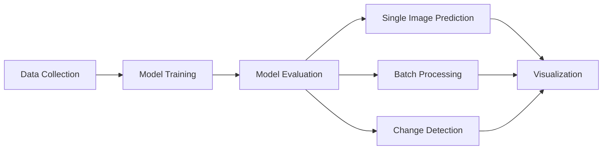

<div align="center">

  <h1 align="center">🌲 Deforestation Detection System</h1>
  <h3 align="center">AI-Powered Satellite Image Analysis for Environmental Monitoring</h3>

  <p align="center">
    
    
    
    
    
    
  </p>

  <p align="center">
    <a href="#-features">Features</a> •
    <a href="#-installation">Installation</a> •
    <a href="#-usage">Usage</a> •
    <a href="#-results">Results</a> •
    <a href="#-contributing">Contributing</a>
  </p>

</div>

---

## 📖 Overview

A sophisticated deep learning system for detecting deforestation in satellite imagery using **Convolutional Neural Networks (CNNs)** with transfer learning. This project leverages state-of-the-art computer vision techniques to monitor environmental changes and help combat deforestation through automated analysis.

### 🎯 Key Capabilities

- 🛰️ **Satellite Image Processing**: Handle various satellite imagery formats including GeoTIFF
- 🤖 **Deep Learning Models**: CNN architectures with transfer learning (ResNet50, EfficientNetB0, VGG16)
- 📊 **Vegetation Analysis**: Calculate NDVI and forest coverage metrics
- 🔄 **Change Detection**: Compare temporal satellite images to detect deforestation
- 📈 **Batch Processing**: Process entire directories of images efficiently
- 🎨 **Advanced Visualization**: Generate heatmaps, comparison plots, and detailed reports

## ✨ Features

<div align="center">

| Feature | Description |
|---------|-------------|
| 🤖 **Deep Learning** | CNN-based classification with transfer learning (ResNet50, EfficientNetB0, VGG16) |
| 🛰️ **Satellite Processing** | Handles satellite imagery including GeoTIFF files |
| 📊 **Vegetation Analysis** | Calculates NDVI and forest coverage metrics |
| 🔄 **Change Detection** | Compare before/after images to detect deforestation over time |
| 📦 **Batch Processing** | Process entire directories of satellite images efficiently |
| 🎨 **Visualization** | Generate heatmaps, comparison plots, and detailed reports |
| 🎲 **Sample Data** | Automatically generates synthetic training data for testing |

</div>

---

## 🚀 Quick Start

```bash
# Clone the repository
git clone https://github.com/sujayd033/satellite-deforestation-detection-.git
cd satellite-deforestation-detection-

# Install dependencies
pip install -r requirements.txt

# Train the model
python main.py train --epochs 30

# Make predictions
python main.py predict --image path/to/image.png --visualize
```

## 📦 Installation

### Prerequisites

- Python 3.8 or higher
- pip package manager

### Setup

1. **Clone the repository**
```bash
git clone https://github.com/sujayd033/satellite-deforestation-detection-.git
cd satellite-deforestation-detection-
```

2. **Install dependencies**
```bash
pip install -r requirements.txt
```

3. **Verify installation**
```bash
python main.py --help
```

---

## 🏗️ Project Structure

```
satellite-deforestation-detection-/
├── config.py                 # Configuration settings
├── data_preprocessing.py     # Image processing and data generation
├── model.py                  # Deep learning model architectures
├── train.py                  # Training script
├── inference.py              # Prediction and inference pipeline
├── visualization.py          # Visualization tools
├── main.py                   # CLI entry point
├── requirements.txt          # Python dependencies
├── README.md                 # This file
├── .gitignore               # Git ignore rules
├── data/                    # Dataset directory
│   └── sample_train/        # Sample training data
├── models/                  # Trained models
└── results/                 # Prediction results and visualizations
```

## Project Structure

```
.
├── config.py                 # Configuration settings
├── data_preprocessing.py     # Image processing and data generation
├── model.py                  # Deep learning model architectures
├── train.py                  # Training script
├── inference.py              # Prediction and inference pipeline
├── visualization.py          # Visualization tools
├── main.py                   # CLI entry point
├── requirements.txt          # Python dependencies
└── README.md                 # This file
```

## 💻 Usage

### 🎓 Training the Model

Train a new deforestation detection model with custom parameters:

```bash
python main.py train --epochs 30 --batch-size 32 --backbone efficientnetb0 --plot-history
```

**Training Options:**
| Option | Description | Default |
|--------|-------------|---------|
| `--epochs` | Number of training epochs | 20 |
| `--batch-size` | Batch size for training | 16 |
| `--backbone` | Model architecture (resnet50, efficientnetb0, vgg16, simple) | simple |
| `--plot-history` | Generate training history plots | False |

> 💡 **Tip**: The training script automatically generates a sample dataset if none exists.

---

### 🔮 Making Predictions

#### Single Image Prediction

```bash
python main.py predict --image path/to/image.png --visualize
```

#### Batch Prediction (Directory)

```bash
python main.py predict --directory path/to/images --visualize
```

#### Compare Two Images (Before/After)

```bash
python main.py predict --compare before.png after.png --visualize
```

#### Generate Heatmap Visualization

```bash
python main.py predict --image path/to/image.png --heatmap --visualize
```

**Prediction Options:**
| Option | Description | Default |
|--------|-------------|---------|
| `--model` | Path to trained model | models/deforestation_detector.h5 |
| `--threshold` | Detection threshold | 0.5 |
| `--pattern` | File pattern for directory search | *.png |
| `--visualize` | Generate visualization of results | False |
| `--heatmap` | Generate heatmap visualization | False |

## ⚙️ Configuration

Edit `config.py` to customize the system behavior:

```python
# Model Configuration
IMG_SIZE = 256              # Image size for processing
BATCH_SIZE = 16             # Training batch size
EPOCHS = 20                 # Number of training epochs
LEARNING_RATE = 0.001       # Learning rate for optimizer

# Data Configuration
TRAIN_SPLIT = 0.8           # Training data split
VAL_SPLIT = 0.1             # Validation data split
TEST_SPLIT = 0.1            # Test data split

# Detection Thresholds
FOREST_COVERAGE_THRESHOLD = 0.3  # Minimum forest coverage
CHANGE_THRESHOLD = 0.2           # Minimum change to flag as deforestation
```

---

## 🧠 Model Architecture

The system uses **transfer learning** with pre-trained backbones:

<div align="center">

| Architecture | Layers | Parameters | Description |
|--------------|--------|------------|-------------|
| **ResNet50** | 50 | 25.6M | Deep residual network with skip connections |
| **EfficientNetB0** | - | 5.3M | Efficient compound scaling |
| **VGG16** | 16 | 138M | Classic VGG architecture |
| **Simple CNN** | Custom | 320K | Lightweight custom CNN |

</div>

**Model Components:**
- 📥 **Pre-trained Backbone**: Frozen initially for feature extraction
- 🔄 **Global Average Pooling**: Reduces spatial dimensions
- 🧱 **Dense Layers**: With dropout for regularization
- 🎯 **Binary Classification**: Sigmoid activation for deforestation detection

---

## 📊 Vegetation Analysis

The system calculates advanced vegetation metrics:

| Metric | Formula | Purpose |
|--------|---------|---------|
| **NDVI** | (NIR - Red) / (NIR + Red) | Measures vegetation health |
| **Forest Coverage** | % of area above threshold | Estimates forest density |
| **Change Detection** | Coverage(t2) - Coverage(t1) | Detects deforestation over time |

---

## 📈 Results

### Training Performance

```
Training Accuracy: 100%
Validation Accuracy: 97.5%
Validation AUC: 1.0
```

### Output Files

Results are saved in the `results/` directory:

| File | Description |
|------|-------------|
| `prediction.png` | Single image prediction visualization |
| `heatmap_prediction.png` | Heatmap showing deforestation probability |
| `batch_predictions.png` | Grid of batch predictions |
| `comparison.png` | Before/after comparison |
| `detection_report.txt` | Detailed text report |
| `training_history.png` | Training loss and accuracy plots |

Trained models are saved in the `models/` directory.

## Model Architecture

The system uses transfer learning with pre-trained backbones:

1. **ResNet50**: Deep residual network with 50 layers
2. **EfficientNetB0**: Efficient convolutional neural network
3. **VGG16**: Classic VGG architecture with 16 layers

The model includes:
- Pre-trained backbone (frozen initially)
- Global average pooling
- Dense layers with dropout for regularization
- Binary classification output (sigmoid activation)

## Vegetation Analysis

The system calculates:
- **NDVI (Normalized Difference Vegetation Index)**: Measures vegetation health
- **Forest Coverage**: Percentage of area covered by forest
- **Change Detection**: Compares forest coverage between time periods

## Output

Results are saved in the `results/` directory:
- `prediction.png`: Single image prediction visualization
- `heatmap_prediction.png`: Heatmap showing deforestation probability
- `batch_predictions.png`: Grid of batch predictions
- `comparison.png`: Before/after comparison
- `detection_report.txt`: Detailed text report
- `training_history.png`: Training loss and accuracy plots

Trained models are saved in the `models/` directory.

## 🎯 Example Workflow

<div align="center">



</div>

### Step-by-Step Guide

**1️⃣ Train the Model**
```bash
python main.py train --epochs 30 --plot-history
```

**2️⃣ Predict on New Images**
```bash
python main.py predict --image satellite_image.png --visualize --heatmap
```

**3️⃣ Batch Process a Directory**
```bash
python main.py predict --directory satellite_images/ --visualize
```

**4️⃣ Compare Temporal Changes**
```bash
python main.py predict --compare 2020_image.png 2024_image.png --visualize
```

---

## 🔧 Advanced Usage

### Using Custom Data

Organize your data as:
```
data/
└── custom_train/
    ├── forest/
    │   ├── image1.png
    │   ├── image2.png
    │   └── ...
    └── deforested/
        ├── image1.png
        ├── image2.png
        └── ...
```

Then modify `train.py` to use your custom data directory.

### Programmatic Usage

```python
from inference import DeforestationPredictor
from visualization import ResultVisualizer

# Load predictor
predictor = DeforestationPredictor(model_path='models/deforestation_detector.h5')

# Make prediction
result = predictor.predict_single_image('image.png')

# Visualize
visualizer = ResultVisualizer()
visualizer.plot_prediction(image, result, save_path='result.png')
```

---

## 🛠️ Technical Details

| Component | Technology |
|-----------|------------|
| **Framework** | TensorFlow/Keras |
| **Image Processing** | OpenCV, Rasterio (for GeoTIFF) |
| **Visualization** | Matplotlib, Seaborn |
| **Supported Formats** | PNG, JPG, GeoTIFF |
| **Python Version** | 3.8+ |

---

## ⚠️ Limitations

- ⚠️ Synthetic sample data is for testing only - use real satellite imagery for production
- ⚠️ Model performance depends on quality and diversity of training data
- ⚠️ GeoTIFF support requires proper installation of rasterio and GDAL
- ⚠️ Currently supports RGB imagery; multi-spectral support planned

---

## 🚀 Future Improvements

- [ ] Support for multi-spectral satellite imagery
- [ ] Semantic segmentation for pixel-level deforestation maps
- [ ] Time-series analysis for deforestation trends
- [ ] Integration with satellite data APIs (Sentinel, Landsat)
- [ ] Web interface for easy predictions
- [ ] Mobile app for field use
- [ ] Real-time monitoring dashboard
- [ ] API for integration with other systems

---

## 🤝 Contributing

Contributions are welcome! Please feel free to submit a Pull Request.

1. Fork the repository
2. Create your feature branch (`git checkout -b feature/AmazingFeature`)
3. Commit your changes (`git commit -m 'Add some AmazingFeature'`)
4. Push to the branch (`git push origin feature/AmazingFeature`)
5. Open a Pull Request

---

## 📝 License

This project is provided as-is for educational and research purposes.

---

## 👨‍💻 Author

**Sujay Dharmavar**

- GitHub: [@sujayd033](https://github.com/sujayd033)
- Email: sujaydharmavar@gmail.com

---

## 🙏 Acknowledgments

- TensorFlow team for the deep learning framework
- Keras for the high-level neural networks API
- OpenCV community for computer vision tools
- All contributors to open-source satellite imagery datasets

---

<div align="center">

**⭐ If you find this project helpful, please consider giving it a star! ⭐**

Made with ❤️ by [Sujay Dharmavar](https://github.com/sujayd033)

</div>

## Advanced Usage

### Using Custom Data

Organize your data as:
```
data/
└── custom_train/
    ├── forest/
    │   ├── image1.png
    │   ├── image2.png
    │   └── ...
    └── deforested/
        ├── image1.png
        ├── image2.png
        └── ...
```

Then modify `train.py` to use your custom data directory.

### Programmatic Usage

```python
from inference import DeforestationPredictor
from visualization import ResultVisualizer

# Load predictor
predictor = DeforestationPredictor(model_path='models/deforestation_detector.h5')

# Make prediction
result = predictor.predict_single_image('image.png')

# Visualize
visualizer = ResultVisualizer()
visualizer.plot_prediction(image, result, save_path='result.png')
```

## Technical Details

- **Framework**: TensorFlow/Keras
- **Image Processing**: OpenCV, Rasterio (for GeoTIFF)
- **Visualization**: Matplotlib, Seaborn
- **Supported Formats**: PNG, JPG, GeoTIFF

## Limitations

- Synthetic sample data is for testing only - use real satellite imagery for production
- Model performance depends on quality and diversity of training data
- GeoTIFF support requires proper installation of rasterio and GDAL

## Future Improvements

- [ ] Support for multi-spectral satellite imagery
- [ ] Semantic segmentation for pixel-level deforestation maps
- [ ] Time-series analysis for deforestation trends
- [ ] Integration with satellite data APIs (Sentinel, Landsat)
- [ ] Web interface for easy predictions

## License

This project is provided as-is for educational and research purposes.
